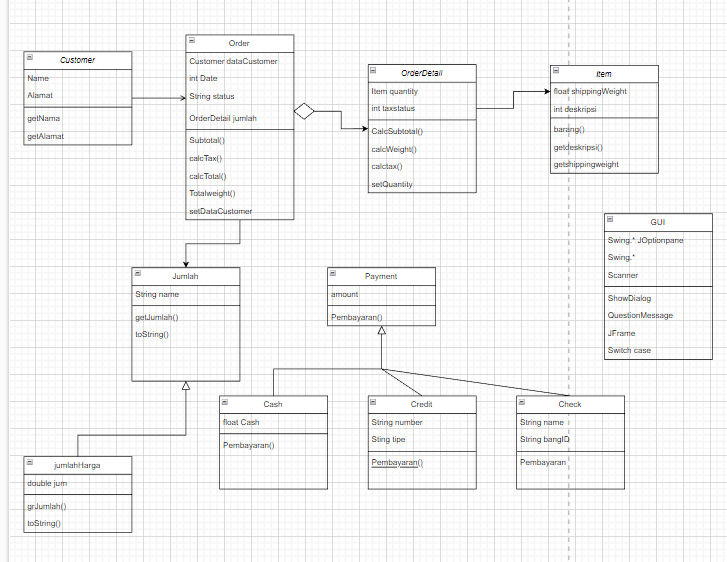
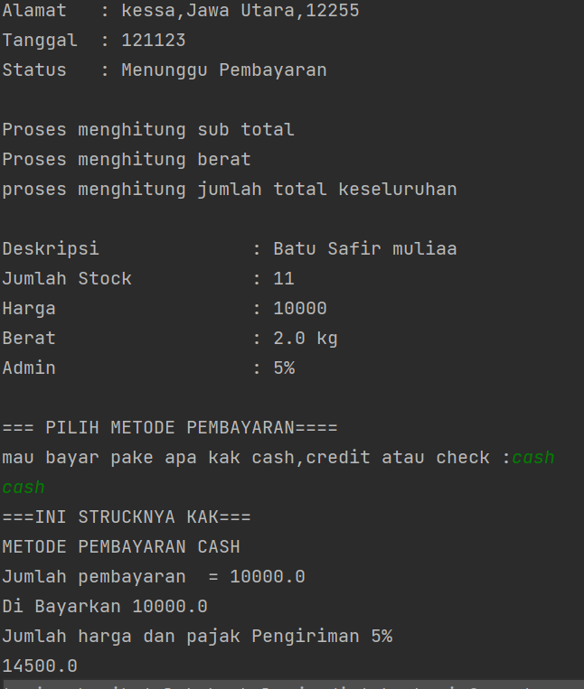
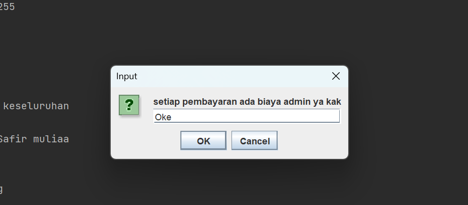
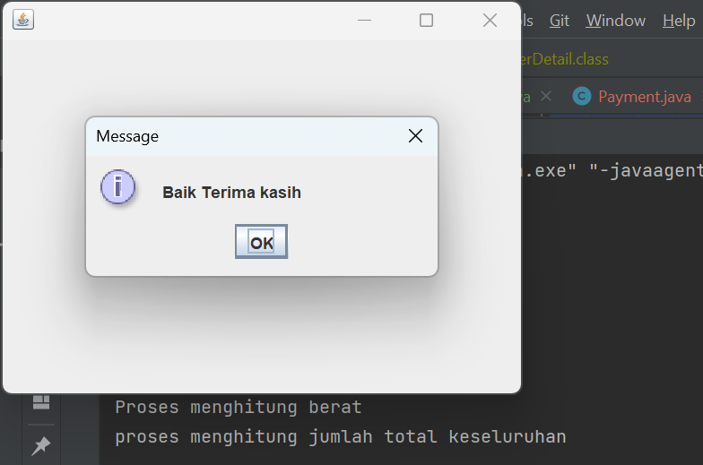
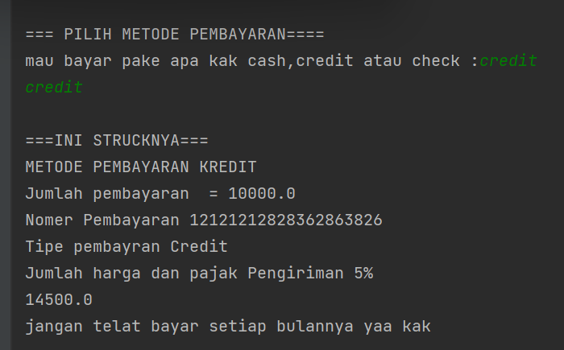
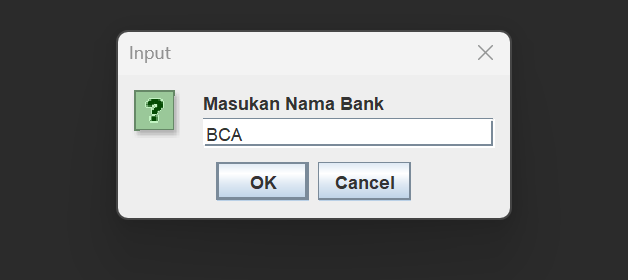
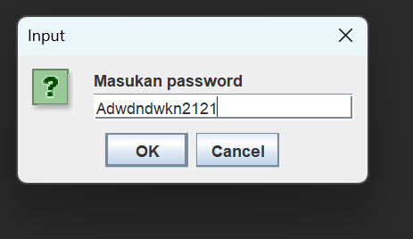
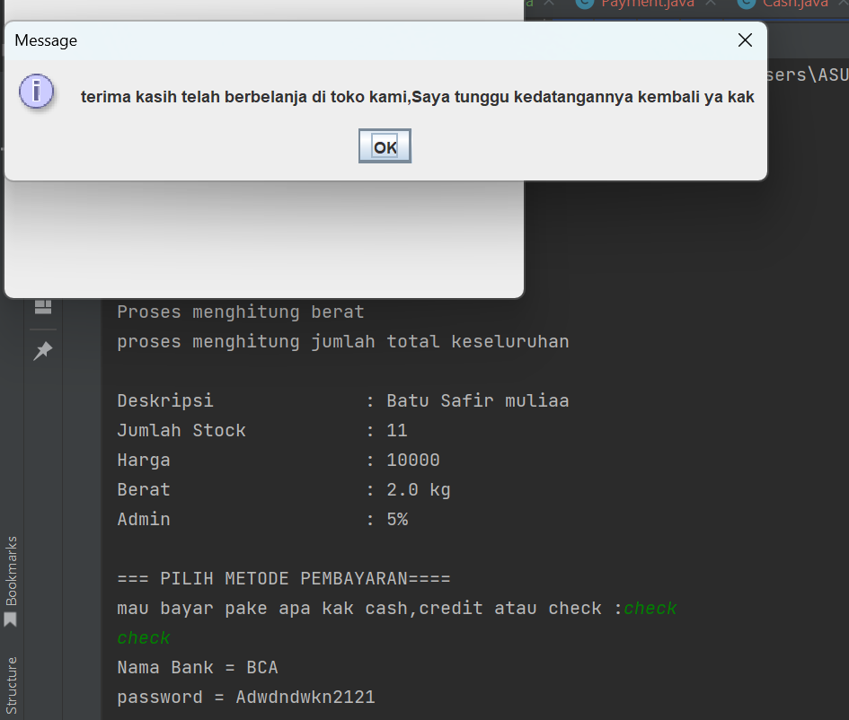
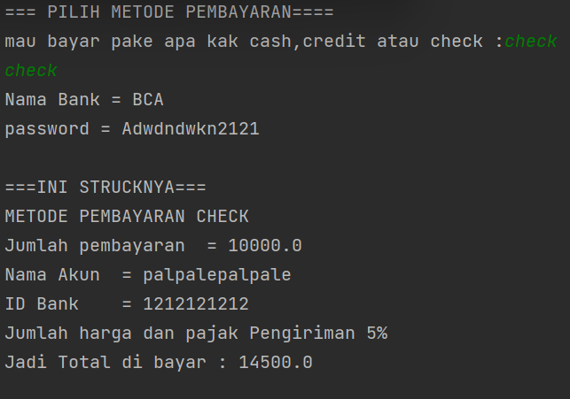

# Project UAS
## Pemrograman Orientasi Objek

````shell
Nama   : Ikram Ramadhan
Nim    : 312110478
Matkul : Pemrograman Orientasi Objek
````
* 

### 1. File Customer.java
* *CODINGAN FILE 1

```java
package praktikum8;

public class Customer {
    private String name;
    private String alamat;

    public String getAlamat() {
        return alamat;
    }

    public String getName() {
        return name;
    }

    public Customer(String name , String alamat){
        this.name = name;
        this.alamat = alamat;
    }
}

```
### 2. File Item.java
* *CODINGAN FILE 2

```java
package Praktikum8;

public class Item {

    private final float shipingWeight;
    private final int deskripsi;


    //method
    public void Barang(){

        System.out.println("\nDeskripsi              : Batu Safir muliaa");
        System.out.println("Jumlah Stock           : 11");
        System.out.println("Harga                  : " +getDeskripsi());

    }
    // getter
    public int getDeskripsi() {
        return deskripsi;
    }

    public double getShipingWeight() {
        return shipingWeight;
    }

    public Item(int deskripsi,Float shipingWeight) {
        this.deskripsi = deskripsi;
        this.shipingWeight = shipingWeight;
    }


}


```
### 3. File OrderDetail.java
* *CODINGAN FILE 3

```java
package Praktikum8;

public class OrderDetail {
    private Item quantity ;
    private final int taxStatus;

    // operator calcSubTotal asosiasi dari class Item
    public void calcSubTotal (){
        quantity.Barang();
    }
    // operator asosiasi dari class Item juga
    public void calcWeight (){

        System.out.println("Berat                  : " + quantity.getShipingWeight() +" kg");
    }

    //operator class ini sendiri
    public void calcTax (){
        System.out.println("Admin                  : " + taxStatus +"%");
    }

    // setter
    public void setQuantity(Item quantity) {
        this.quantity = quantity;
    }

    public OrderDetail(int taxStatus) {
        this.taxStatus = taxStatus;
    }

}


```
### 4. File Order.java
* *CODINGAN FILE 4

```java
package Praktikum8;

import java.util.Arrays;

public class Order {

    //atribute datacustomer asosiasi dari Class customer
       private Customer dataCustomer;
       private final int date;
       private final String status;
       private final OrderDetail jumlah;


       // operasi SubTotal asosiasi dari orderDetail
    public void SubTotal (){
        System.out.println("Proses menghitung sub total");
    }

    // operasi calcTax agregasi pada OrderDetail
    public void calcTax(){

        jumlah.calcTax();

    }

    public void Total(){

        System.out.println("proses menghitung jumlah total keseluruhan");
    }

    public void TotalWeight (){
        System.out.println("Proses menghitung berat");
    }

    // Menggunkan for untuk araylist
       public void infoOrderan(){

           for (String s : Arrays.asList("\n"+"Customer : "+ dataCustomer.getName() , "Alamat   : " + dataCustomer.getAlamat()
                   ,"Tanggal  : " + date, "Status   : " + status+"\n")) {
               System.out.println(s);
           }

       }

       // Setter untuk Membuat data customer
    public void setDataCustomer(Customer dataCustomer) {
        this.dataCustomer = dataCustomer;
    }


    /* karena pada Customer ini menggunakan asosiasi saya tidak membuat object pada constructor,
    namun pada jumlah saya membuat parameter di constructor
     */
    public Order (int date, String status, OrderDetail jumlah){
        this.date = date;
        this.status = status;
        this.jumlah = jumlah;
       }

    }


```
### 5. File Payment.java
* *CODINGAN FILE 5

```java
package Praktikum8;

public class Payment{

    private final float amount;

    public void Pembayaran(){

        System.out.println("Jumlah pembayaran  = " + amount);

    }

    public Payment(float amount) {
        this.amount = amount;
    }
}


```
### 6. File Cash.java
* *CODINGAN FILE 6

```java
package Praktikum8;

public class Cash extends Payment{

    private final float cash;


    @Override
    public void Pembayaran(){
        super.Pembayaran();
        System.out.println("Di Bayarkan " + cash);
    }

    public Cash(float amount, float cash) {
        super(amount);
        this.cash = cash;

    }
}


```
### 7. File Credit.java
* *CODINGAN FILE 7

```java
package Praktikum8;

public class Credit extends Payment{

    private String number;
    private String tipe;


    public void Pembayaran(){

        super.Pembayaran();
        System.out.println("Nomer Pembayaran" + number);
        System.out.println("Tipe pembayran" + tipe);


    }

    public Credit(Float amount, String number, String tipe) {
        super(amount);
        this.number = number;
        this.tipe = tipe;
    }

}

```
### 8. File check.java
* *CODINGAN FILE 8

```java
package Praktikum8;

public class Check extends Payment{

    private String name;
    private String bangID;


    @Override
    public void Pembayaran(){
        super.Pembayaran();
        System.out.println("Nama Akun  = " + name);
        System.out.println("ID Bank    = " +bangID );
    }

    public Check(float amount, String name, String bangID) {
        super(amount);
        this.name = name;
        this.bangID = bangID;

    }
}


```
### 9. File Jumlah.java
* *CODINGAN FILE 9

```java
package Praktikum8;

public abstract class Jumlah {

    private String name;

    public abstract double getJumlah();

    public String toString() {
        return "Jumlah harga di potong pajak ongkir ";
    }

}

```
### 10. File JumlahHarga.java
* *CODINGAN FILE 10

```java
package Praktikum8;

public class JumlahHarga extends Jumlah {
     private double jum;

     public JumlahHarga (double jum){
     this.jum= jum;
     }

    public double getJumlah() {
         return jum + 4500;

     }


    public String toString() {
        return "Jumlah harga dan pajak Pengiriman 5%";
    }
}


```
### 11. File Main.java
* *CODINGAN FILE 11

```java
package Praktikum8;

import javax.swing.*;
import java.util.Scanner;
import javax.swing.JOptionPane;


public class Main {
    public static void main(String[] args) {

        // membuat object orderan pada pada kelas Order
        Order orderan1 = new Order(121123,"Menunggu Pembayaran",new OrderDetail(5));
        // List data customer menggunakan setter
        orderan1.setDataCustomer(new Customer("palpalepalpale","kessa,Jawa Utara,12255"));

        // object abstract class
        JumlahHarga jum = new JumlahHarga(10000);

        // membuat object Inherite payment
        Cash COD = new Cash(10000,10000);
        Credit Ngutang = new Credit((float) 10000," 12121212828362863826"," Credit");
        Check cek = new Check(10000,"palpalepalpale","1212121212");

        // object OrderDetail
        OrderDetail barang = new OrderDetail(5);
        barang.setQuantity(new Item(10000, (float) 2));

        /* callmethod menggunakan for dan Arrsday.asList pada infoOrderan
         beserta operasi class lain
         */
        orderan1.infoOrderan();
        orderan1.SubTotal();
        orderan1.TotalWeight();
        orderan1.Total();
        barang.calcSubTotal();
        barang.calcWeight();
        orderan1.calcTax();

        System.out.println();
        System.out.println("=== PILIH METODE PEMBAYARAN====");
        System.out.print("mau bayar pake apa kak cash,credit atau check :");

        //scanner untuk memasukan input user
        Scanner masukan = new Scanner(System.in);

        // Membuat GUI dan dengan switch case
        // object jframe untuk menampilkan frame
        JFrame jFrame;
        String pilih;
        masukan.next();
        pilih = masukan.next();
        switch (pilih) {
            case "cash" -> {
                System.out.println("===INI STRUCKNYA KAK===");
                System.out.println("METODE PEMBAYARAN CASH");
                COD.Pembayaran();
                //memanggil method class abstract
                System.out.println(jum.toString());
                System.out.println(jum.getJumlah());
                System.out.println("terima kasih telah berbelanja di toko kami,Saya tunggu kedatangannya kembali ya kak");
            }
            case "credit" -> {

                jFrame = new JFrame();
                jFrame.setSize(400, 300);
                jFrame.setVisible(true);
                JOptionPane.showInputDialog(null,
                        "setiap pembayaran ada biaya admin ya kak",JOptionPane.QUESTION_MESSAGE);
                JOptionPane.showMessageDialog(jFrame,"Baik Terima kasih");
                System.out.println();

                System.out.println("===INI STRUCKNYA===");
                System.out.println("METODE PEMBAYARAN KREDIT");
                Ngutang.Pembayaran();
                //memanggil method class abstract
                System.out.println(jum.toString());
                System.out.println(jum.getJumlah());
                System.out.println("jangan telat bayar setiap bulannya yaa kak");
            }

            case "check" -> {

                jFrame = new JFrame();
                jFrame.setSize(400, 300);
                jFrame.setVisible(true);

                String inputString=
                        JOptionPane.showInputDialog(null,"Masukan Nama Bank",
                                JOptionPane.QUESTION_MESSAGE);
                String str = String.format(inputString);

                String input2String=
                        JOptionPane.showInputDialog(null,"Masukan password",
                                JOptionPane.QUESTION_MESSAGE);

                String pass = String.format(input2String);
                System.out.println("Nama Bank = " +str);
                System.out.println("password = " +pass);
                System.out.println();
                JOptionPane.showMessageDialog(jFrame,"terima kasih telah berbelanja di toko kami,Saya tunggu kedatangannya kembali ya kak");


                System.out.println("===INI STRUCKNYA===");
                System.out.println("METODE PEMBAYARAN CHECK");
                cek.Pembayaran();
                //memanggil method class abstract
                System.out.println(jum.toString());
                System.out.println("Jadi Total di bayar : "+jum.getJumlah());
            }
        }

    }
}


```
*******
* * ! [youtube link]  https://youtu.be/1N_JL3kMtag
********

* 
* 
* 
* 
* 
* 
* 
* 